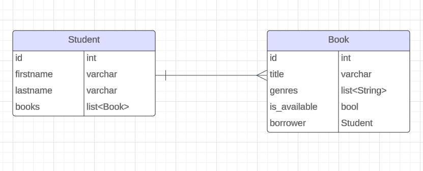
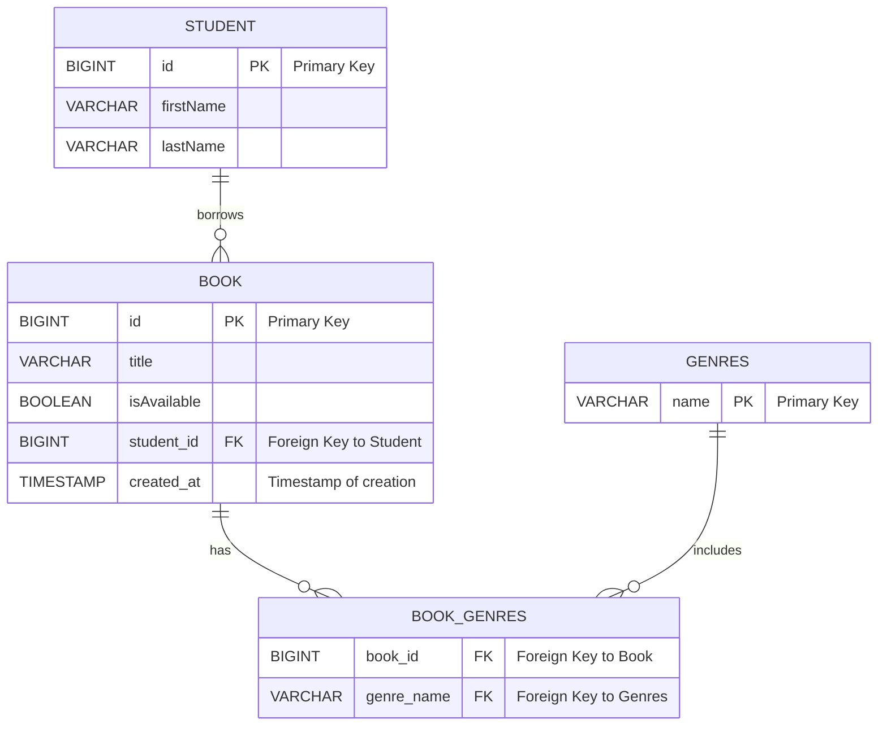

# Brief 15

## Objectif

Dans ce projet nous avons créé une application web qui permet de gérer une bibliothèque, les livres, les emprunteurs et les emprunts.

## Exigence technique

## Database structure

